# Internal Network Firewall Lab – pfSense, Windows & Kali

> This repository documents an isolated VirtualBox internal network lab created for internship training and internal network security observation.

---

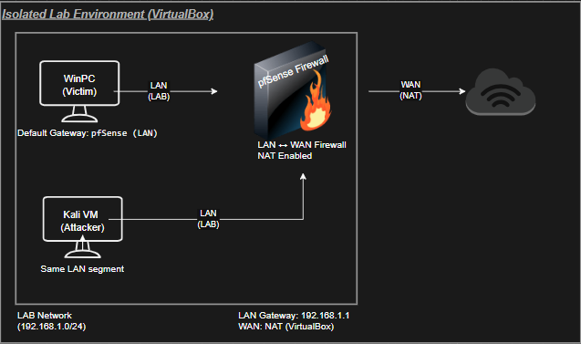

---

## Objective

This lab analyzes how a Windows host behaves when:

- All inbound ports appear filtered  
- A firewall gateway is present  
- The attacker is located in the same LAN segment  

The goal is to observe whether:

**Host discovery, internal interaction, and file retrieval are still possible inside the same network segment even when traditional inbound scanning is blocked.**

---

## Lab Environment

| Role | OS / Hostname | IP Address | Notes |
|------|---------------|------------|------|
| Firewall Gateway | pfSense | `192.168.50.1` | LAN gateway |
| Attacker | Kali Linux | `192.168.50.10` | Scanning & validation |
| Victim | Windows 11 (EVAL) | `192.168.50.11` | Firewall enabled |
| Network | VirtualBox Internal | `192.168.50.0/24` | Isolated segment |

- All machines are on the same internal network  
- Windows uses pfSense as default gateway  
- Environment is fully isolated  

---

# Step 1 – Network Discovery

A subnet discovery scan was performed to identify active hosts.

Purpose:
- Confirm network layout  
- Identify gateway and victim  
- Validate connectivity  

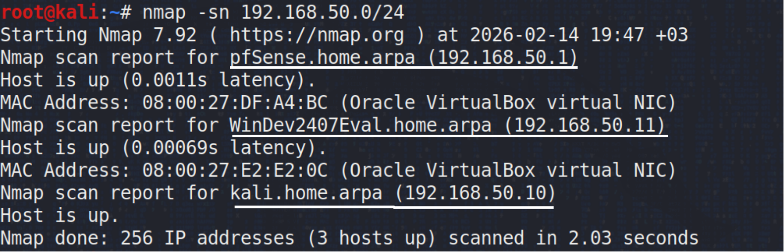

**Observation**

- Gateway detected  
- Victim detected  
- Attacker confirmed  

All hosts are reachable inside the same network.

---

# Step 2 – Target Port Scan

A default port scan was performed against the Windows system.

Purpose:
- Identify exposed services  
- Evaluate firewall filtering  

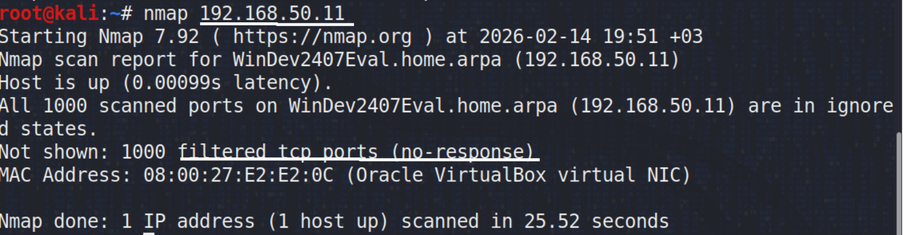

**Result**

All ports returned as **filtered**, indicating firewall-based blocking.

---

# Step 3 – SYN Scan Verification

A SYN scan was used to confirm filtering behavior.

Purpose:
- Validate firewall drop behavior  
- Check for silent filtering  

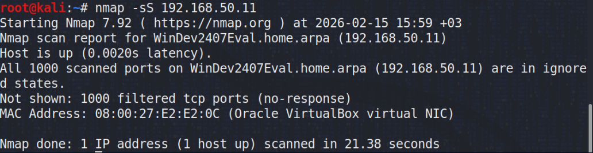

**Result**

- All ports filtered  
- No direct service exposure  

Inbound scanning alone does not reveal accessible services.

---

# Step 4 – Initial SMB Access Attempt

An SMB connection attempt was made to test internal share access.

Purpose:
- Validate SMB accessibility  
- Observe firewall impact  

Initial attempt:

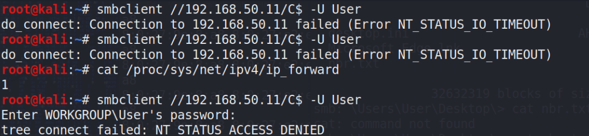

The first attempt resulted in a timeout, indicating blocked or filtered access.

---

# Step 5 – Successful SMB Interaction

A subsequent attempt allowed SMB interaction and directory listing.

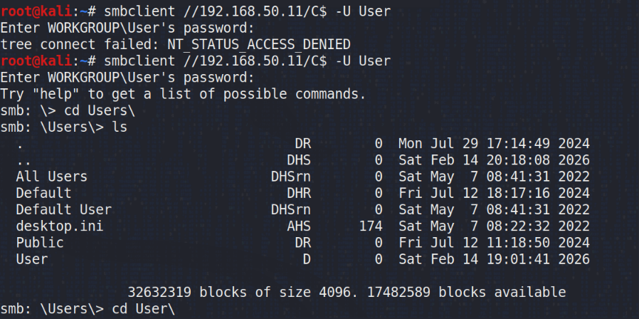

**Observation**

Internal interaction became possible under correct conditions.

This confirms that filtered ports do not always prevent internal host interaction.

---

# Step 6 – Layer-2 Network Validation

ARP and neighbor tables were inspected.

Purpose:
- Confirm same broadcast domain  
- Validate MAC resolution  

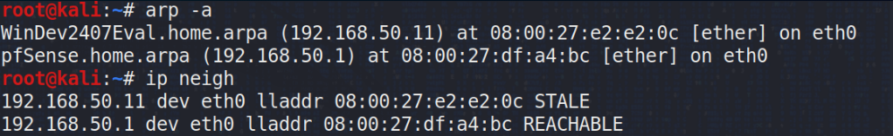

**Result**

- Victim MAC address resolved  
- Gateway reachable  
- Direct LAN communication confirmed  

Layer-2 communication exists even when ports are filtered.

---

# Step 7 – Attacker Network Configuration

The attacker machine’s interface configuration was verified.

Purpose:
- Confirm correct subnet placement  
- Validate IP configuration  

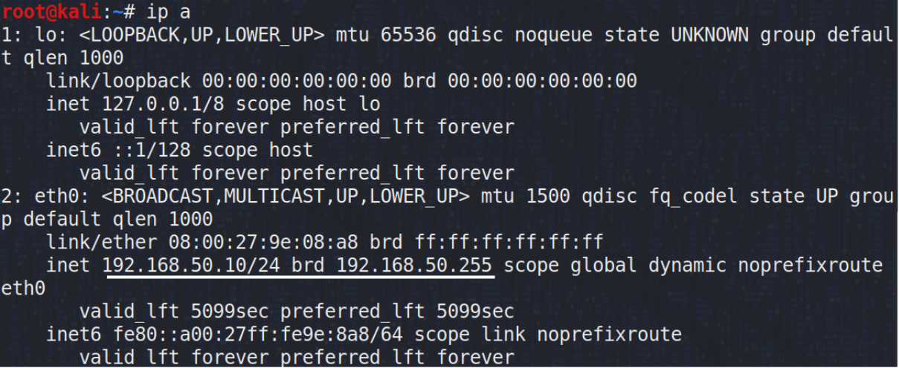

Kali is correctly positioned in the same network.

---

# Step 8 – IP Forwarding Preparation

IP forwarding was enabled on the attacker machine.

Purpose:
- Prepare for routing or relay scenarios  
- Validate forwarding capability  

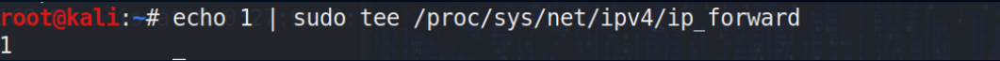

---

# Step 9 – File Access Validation

A known file on the target system was accessed and verified.

Purpose:
- Confirm host interaction  
- Validate successful file retrieval  

File content accessed from attacker system:

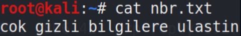

Verification on Windows system:

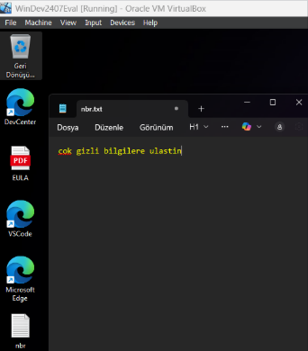

This confirms successful interaction between attacker and victim inside the LAN.

---

# Key Observations

- Inbound port scanning returned fully filtered results  
- Firewall prevented traditional service discovery  
- Hosts remained visible at Layer-2  
- Internal interaction was still possible  
- File retrieval succeeded within LAN  

---

# Conclusion

This lab demonstrates that:

Even when all inbound ports appear filtered,

- Internal network positioning  
- Layer-2 visibility  
- Local access paths  

can still allow interaction between hosts on the same network.

Firewall filtering alone does not fully eliminate internal network interaction risks.

A layered security approach is recommended, including:

- Network segmentation  
- Host hardening  
- Lateral movement monitoring  
- Access control enforcement  

---

**End of Lab**
